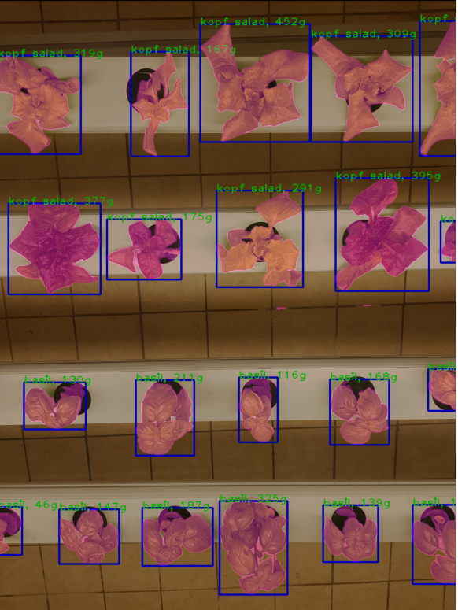

# Image segmentation & classification & area/mass estimation module 

## This model is developed to implement multi task

### 1. Initially, perform image segmmentation

### 2. Each mask is then feeded into image classification module

### 3. Each mask is classified.

### 4. Area or Mass of the object beloing to mask is estimated.

### This image is taken from the hexafarms' fully AI-automated vertical farm.